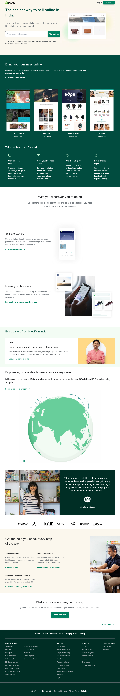

## Hi, I'm Sudhansu Sekhar Mahankuda ! 👋

### 🚀 I'm a front-end developer...

# Shopify_Clone_Project

- This is my second project using **Tailwind CSS**, in this project most of the sections are done using Grid property.After finishing this project I have a good understanding how to build fully responsive projects using **Tailwind CSS**.

---

## Learnt from this Project

- Tailwind

- Tailwind's Components

- Mobile Responsiveness

- Grid

---

- It took me around 12 hours to make this project .

## Technology Used

Project mjorly built from

## 🛠 Skills
HTML, TAILWIND

[Click Here](https://sud-shopify-clone.netlify.app/)

